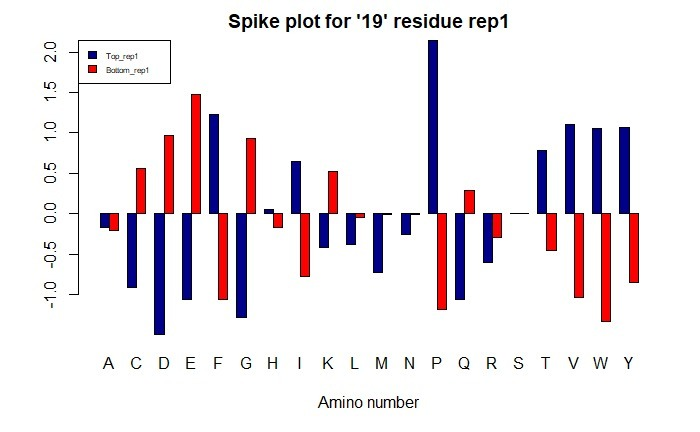

```{r setup, include=FALSE}
knitr::opts_chunk$set(echo = TRUE)
```
# Mutagenic data of spike protein

This is a notebook exploring the SARS-CoV-2 mutagenic data. This dataset measures the binding of different amino acids to the spike protein on the SARS-CoV-2 virus. Different receptor residues (receptor mutations) containing amino acids (A to Y) have been tested in two experiments, and their affinity to the spike protein quantifie. Top_rep and bottom_rep reflect the likelihood of that amino acid being amongst the strongest-binding mutagens and weakest-binding mutagens respectively.

This is significant since if the spike protein strongly binds to particular receptor mutations, the virus targets could change, causing them to potentially attack cells without normal ACE2 receptors, necessitating a shift in vaccine strategies, or diagnostic kit design.

The first step is to import the tidyverse library which will be used to conduct exploratory data analysis, and import the data.

```{r}
library(tidyverse)
file<-read.csv("data.csv",header= TRUE, sep=",")
dim(file)
head(file,N=6L)
tail(file, N=-6L)
fin_res<-file[2340,"Residue.."] # Taking the first residue
fin_start<-file[1,"Residue.."]  # Taking the last residue
res_vector<-fin_start:fin_res   # Formulating a residue vector

```

Then, the data can be compartmentalized into each residue. Residue 19 has been used as an example.

```{r}
bool<-file[file$Residue..==19, ]
```


```{r}
ggplot(data=bool)+geom_point(mapping=aes(x=Substitution,y=Top_rep1))

```


```{r, fig.show='hide'}

counts <- c(bool$Top_rep1,bool$Bottom_rep1)
x <- c(bool$Substitution, bool$Substitution)
regions <- c("Top_rep1", "Bottom_rep1")
col <- c("darkblue","red")

barplot(counts, names.arg=x, main="Spike plot for '19' residue rep1",
  xlab="Amino number", col=c("darkblue","red"),
  legend = rownames(counts), beside=TRUE)

legend("topleft", regions, cex = 0.5, fill = col)


```



Now, it is likely that the amino acid with the highest top_rep value and the least bottom_rep value is the mutagen with the highest affinity for the reactive binding domain (amino acid p, reflected by mut1). Therefore, the difference between the top_rep value and the bottom_rep value will be highest for the amino acid that is most likely to act as the receptor (ie bind to the spike protein) instead of the wild type protein receptor. This is a crude analysis but has been done as a first pass.

```{r}
tdiff1<-abs(bool$Top_rep1-bool$Bottom_rep1)

mut1<-bool$Substitution[which.max(tdiff1)]
print(mut1)

```

mut1 is revealed to be p (Proline), which concurs with the results of the bar graph. The above analysis can be repeated for all valid residues, and a vector of most strongly binding mutagens has been compiled for both experiment 1 (mut1) and experiment 2 (mut2).  

```{r}
tdiff1<-list()
tdiff2<-list()
mut1<-vector()
mut2<-vector()
original<-vector()
res<-vector()

for (num in res_vector) {
  bool2<-file[file$Residue..==num, ]
  if (is.null(bool2)) {
    next
  }
  
  tdif1=abs(bool2$Top_rep1-bool2$Bottom_rep1)
  tdif2=abs(bool2$Top_rep2-bool2$Bottom_rep2)
  
  original<-c(original, bool2[tdif1==0, "Substitution"])
  
  tdiff1<-c(tdiff1,bool2$Residue..[1],abs(bool2$Top_rep1-bool2$Bottom_rep1))
  tdiff2<-c(tdiff2,bool2$Residue..[1],tdif2)
  
  
  mutt1<-bool2$Substitution[which.max(tdif1)]
  mutt2<-bool2$Substitution[which.max(tdif2)]
   if(length(mutt1) != 0)
  {
    res<-c(res,num)
  }
  
  
  mut1<-c(mut1,mutt1)
  mut2<-c(mut2,mutt2)
  
 
  

}
```

These can be compared with the original wild type amino acid that binds to the spike protein, and a table can be formed.
```{r}
smoke <- matrix(c(res,original,mut1,mut2),ncol=4)
colnames(smoke) <- c("Residue","Original","Likely substitute (rep1)","Likely substitute (rep2)")
#rownames <- c("current","former","never")
smoke <- as.table(smoke)
print(smoke)

```
With the above table, we can obtain a subset of strongest receptor mutations (Both with regards to the amino acid and residue number) which both experiments 1 and 2 identify as the same.

```{r}
res_risk<-smoke[smoke[ ,"Likely substitute (rep1)"]==smoke[ ,"Likely substitute (rep2)"], "Residue"]
mut_risk<-smoke[smoke[ ,"Likely substitute (rep1)"]==smoke[ ,"Likely substitute (rep2)"], 2:3]
risk<-matrix(c(res_risk,mut_risk),ncol=3)
colnames(risk)<-c("Residue","Original","Substitute")
risk<-as.table(risk)
print(risk)
```

From the table above, around 46 out of the original 117 residues had a strongly binding mutagen that was identified by both experiments 1 and 2.

A bar chart can illustrate the frequency that the specific receptor mutations occur across the residues tested.


```{r}
barplot(table(risk[ ,"Substitute"]), main="Count of mutagens",xlab="Mutagen",ylab="Count")
print(table(risk[ ,"Substitute"]))

```

We can see that across the residues with the same strongly binded mutagens identified across both experiments 1 and 2, the P (Proline) amino acid mutated receptor is most commonly found with a strong affinity to the spike protein, with a count of 15. However, with respect to the original 117 residues, this consititutes roughly 13 %, which is a relatively small fraction.

This concludes the analysis. The results can be taken forward, and more trials can be conducted to verify or continue refining the most strongly binding mutations. Additionally, one can map the mutations to biological receptors and try to understand which cell lines are particularly vulnerable (Other than those with normal ACE2 receptors).

